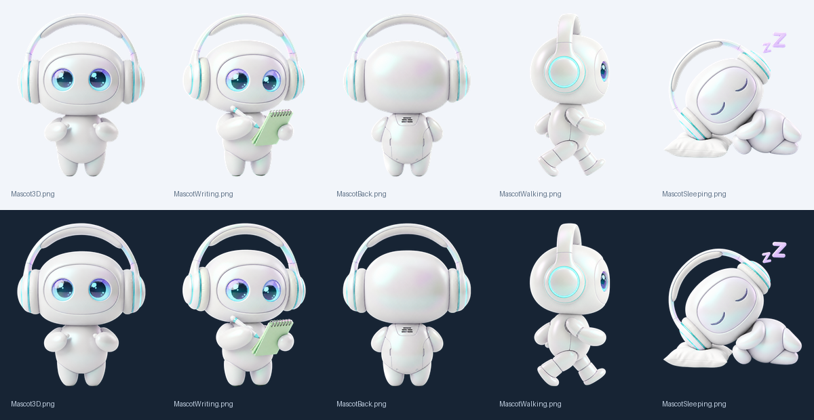

# Bộ Resources mới — 01/10/2026

Đã review các ảnh đang được app đóng gói và làm lại bộ mascot cùng icon. Giữ nhận diện robot trắng ngọc trai, đầu oval bo tròn liền mạch, tai nghe mint và mắt teal–violet. Ánh sáng trung tính, màu phản chiếu tiết chế, tỷ lệ nhỏ gọn và viền mượt.

## Thay đổi

| Resource | Kết quả |
|---|---|
| Mascot3D.png | Dáng đứng chính diện, cùng bố cục 621 × 783 để giữ vị trí mắt tương tác |
| MascotWriting.png | Mắt tập trung, sổ mint và bút, không còn nét viết trên thân |
| MascotBack.png | Dáng đứng nhìn từ sau, tỷ lệ và tai nghe đồng nhất |
| MascotWalking.png | Nhìn ngang đi sang phải, viền sạch và chân rõ |
| MascotSleeping.png | Gối và hai chữ Z giữ nguyên, xóa sạch mảng nền và đốm quanh tai nghe |
| MascotBody.png | Tách từ đúng ảnh đứng mới, cùng canvas 621 × 783 |
| MascotLegLeft/Right.png | Chân mới 110 × 125, khớp màu và đường nối với thân |
| AppIcon.png / icon_1024.png | Icon navy–mint mới, đúng 1024 × 1024 |
| AppIcon.icns | Đóng gói icon nhiều kích thước cho macOS |
| Mini.png | Bản pixel 64 × 80 cùng nhận diện tai nghe và mắt với mascot 3D |

Hai ảnh thử nghiệm không được app sử dụng (`vision_test.png`, `MascotWriting_new.png`) chuyển sang `work/resource-review/retired/`. Bản gốc toàn bộ Resources được sao lưu tại `work/resource-review/originals/` trước khi thay thế.

## Cách tạo và tách nền

Dùng công cụ imagegen tích hợp để tạo ảnh. Bản nền trong suốt trực tiếp được loại vì vẫn còn nhiễu, không đưa vào app. Năm dáng 3D được tạo lại trên nền magenta tương phản; Python tách theo màu nền và khôi phục màu viền, không dùng ngưỡng trắng nên giữ được vỏ robot và gối. Các ảnh cuối là RGBA thật, đã xem trên nền sáng và tối.

Prompt chính: “Giữ đúng robot trắng ngọc trai có đầu oval bo tròn, tai nghe mint và mắt teal–violet. Render porcelain mượt, ánh sáng studio trung tính, viền rõ, không đổi nhận diện. Nền magenta đồng nhất, không hắt màu lên robot, không nền đất hay bóng ngoài nhân vật.” Mỗi dáng bổ sung chỉ dẫn đứng / viết vào sổ mint / nhìn từ sau / bước sang phải / ngủ trên gối với hai chữ Z.

Prompt icon: “Icon macOS squircle navy, ánh mint nhẹ, mascot chính diện lớn và rõ ở kích thước nhỏ, không chữ.” Prompt pixel: “Sprite pixel cùng đầu oval bo tròn, tai nghe mint, mắt teal, bảng màu white/navy/mint/lavender, nền trong suốt.”

Ảnh nguồn được giữ tại `work/resource-review/masters/`; xử lý có thể chạy lại với `python3 scripts/prepare-resources.py`, rồi tạo ICNS bằng `iconutil -c icns work/resource-review/TransTools.iconset -o Resources/AppIcon.icns`.

Điều chỉnh duy nhất trong giao diện là kích thước và vị trí ghép hai chân để khớp ảnh mới. Không thay logic dịch, thu âm hoặc chức năng khác. Chuyển động khi chân xoay vẫn là chuyển động 2D, không phải chuỗi frame 3D dựng riêng.

## Kiểm tra đã thực hiện

- Xem từng dáng trên nền sáng/tối và xem ảnh ghép thân/chân.
- Kiểm tra 11 PNG có alpha thật; không có đốm rời nhỏ tại ngưỡng alpha 64. Ảnh ngủ có đúng ba cụm: nhân vật và hai chữ Z; các ảnh còn lại có một cụm chính.
- Build release thành công; các resource được đóng gói khớp SHA-256 với file trong Resources.
- Chữ ký ad-hoc của app qua kiểm tra strict/deep. Chưa chạy lại tất cả trạng thái chuyển động trong giao diện app đang mở.

## Cập nhật hình dáng đầu

Đã bỏ phần nhô nhọn dưới mặt trên toàn bộ resource đang sử dụng, gồm icon và sprite đi bộ. Quy chuẩn hiện tại ở `mascot-design.md`; prompt lịch sử trước lần sửa đầu được thay bằng thiết kế oval bo tròn, không có đuôi bong bóng.
